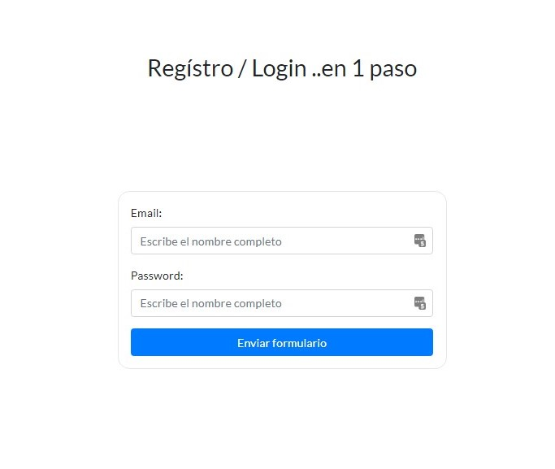
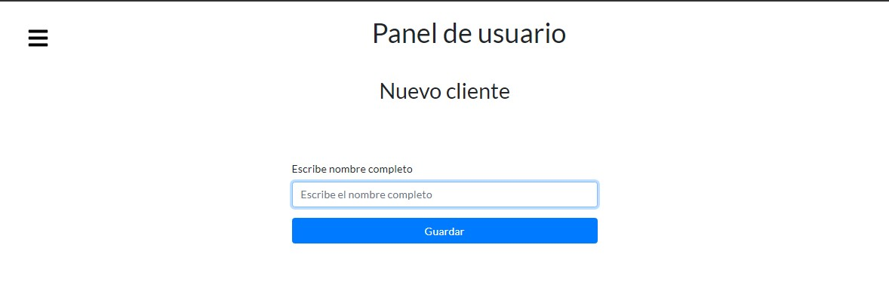
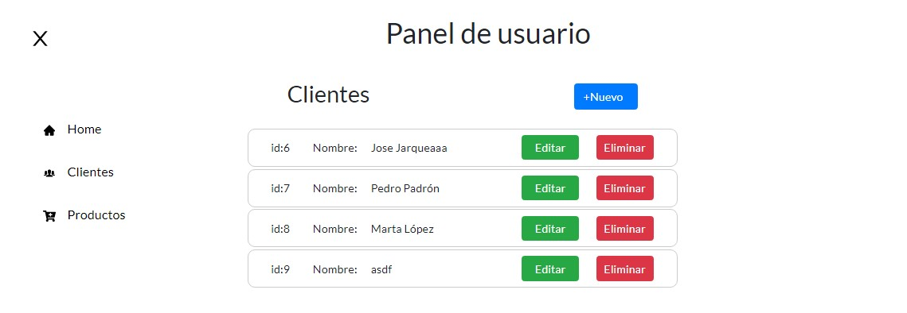
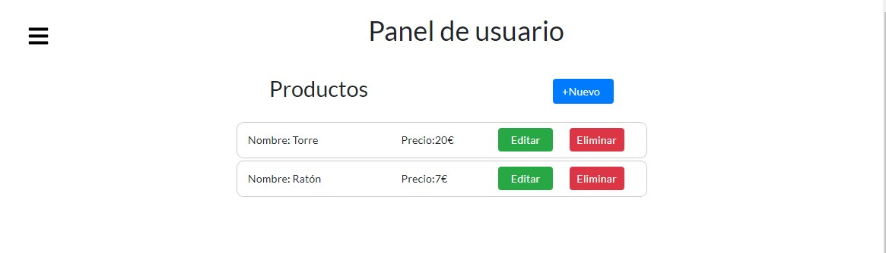

# React Web App - Panel de gestión 🧰
CRUD clientes / artículos

## Tecnologías usadas: 📡

```
React + redux + json-server
```

## Scripts de arranque ⭐

- Arranque de json-server en [http://localhost:4000](http://localhost:4000)
```
yarn startserver
```

- Arranque de cliente de ReactJs en [http://localhost:3000](http://localhost:3000)
```
yarn start
```
### Navegación ⛵
- Si el usuario no existe, guarda usuario en db.json y redirecciona a /customers
- Si el usuario existe, redirecciona a /customers
- Navbar en sidebar izquierdo, se muestra u oculta en base a interacción del usuario dando clic al icono superior izquierdo.
- El menú se oculta al apartar el ratón del propio menú.

## Funcionalidad 🔀
- Registro / Login de usuario en raíz en un mismo paso
- CRUD de clientes usando Hooks y Redux
- CRUD de Productos usando Hooks y Redux
- Gestión de alertas integradas con Redux
- Validación y gestión de errores en formularios

## Diseño 🖌️
- Diseño liviano usando Grid, Flexbox y Bootstrap donde se requería para facilitar la tarea.

## Mejoras 💪
- Por falta de tiempo no he podido aplicar muchas mejores como un autenticado adecuado con jwt y securizar las rutas con un componente de orden superior para que no permita el paso a menos que el usuario esté autenticado.
- El diseño es mejorable también con algo más de tiempo.

## Capturas del proyecto 📷
- ##### Registro / login de usuario

- ##### Panel de usuario / Creación de cliente

- ##### Panel de usuario / CRUD clientes

- ##### Panel de usuario / CRUD productos



